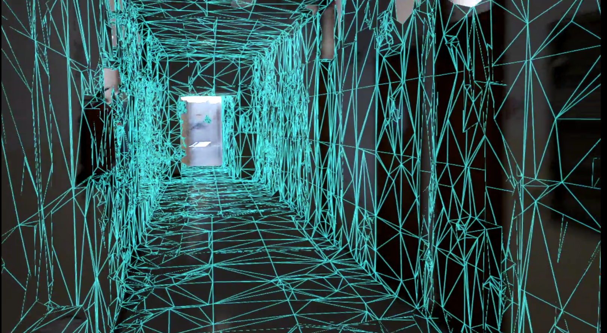
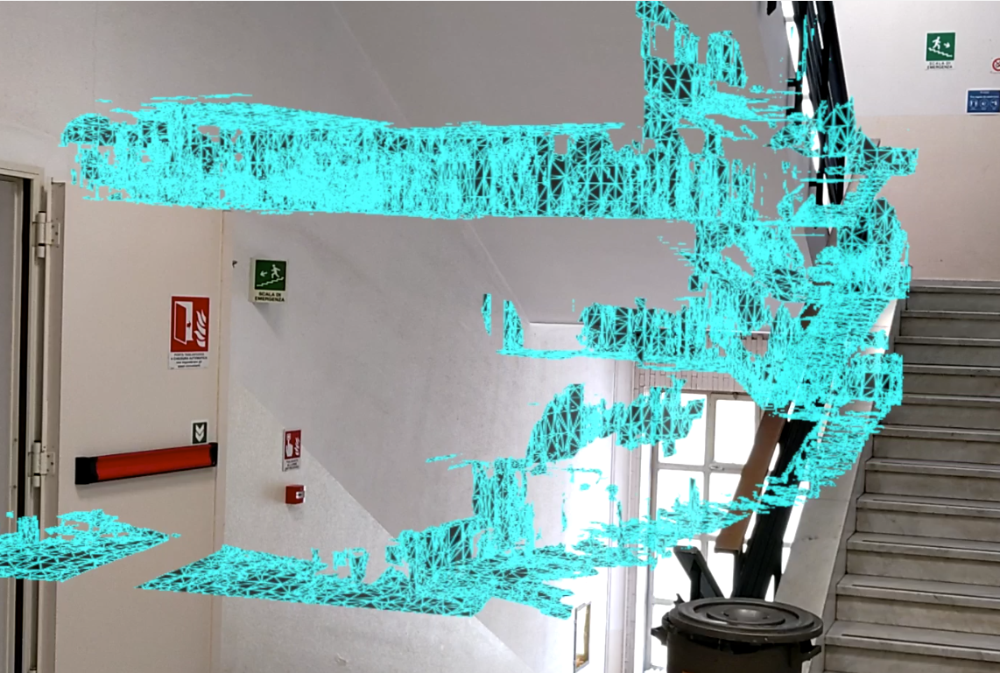

# Thesis Project

## __Project Description__
This is the repository of my Robotics Engineering thesis project, named:  
 _DIONISO-Wearable Sensors and Augmented Reality for Autonomous Mapping and Navigation in Search and Rescue_

 The aim of this project is to provide an Augmented Reality (AR) application able to improve the planning capabilities of Search and Rescue (SAR) operators during disaster scenarios like earthquakes. 
 The application enables operators to cooperate in the building process of a global 3D map of the environment. In particular, SAR agents can explore the enviroment and silultaneously mapping it having both hands free. SAR operators can visualize the map in real-time, in full scale (POV) or in a resized version as well. As shown in the following pictures.
 
  
 
  
 
 The "local maps" generated by a single agents will be then joined into a global one. The next pictures shows how the local maps generated in different sessions are properly overlapped.

 
 Those maps can be enriched with useful information represented as holograms "anchored" in real space that can be visualizable by others operators equiped with AR device.
 
 The nice thing is that Augmented Reality is supported also by mobile devices (e.g. IoS and Android). Therefore, future implementations might enable survivors to cooperate with the rescue operations using their own smartphones.
 
 
 

## Requirements
- Microsoft HoloLens2
- The following: 

## Installation
1. Clone the repository
2. Open it from the Unity Hub
3. Select the Scene
4. Open Build Settings 
5. Switch in The Windows Platfrom Application 
6. Build

## Contacts
Francesco Testa 
email: francesco.testa.ge@gmail.com
