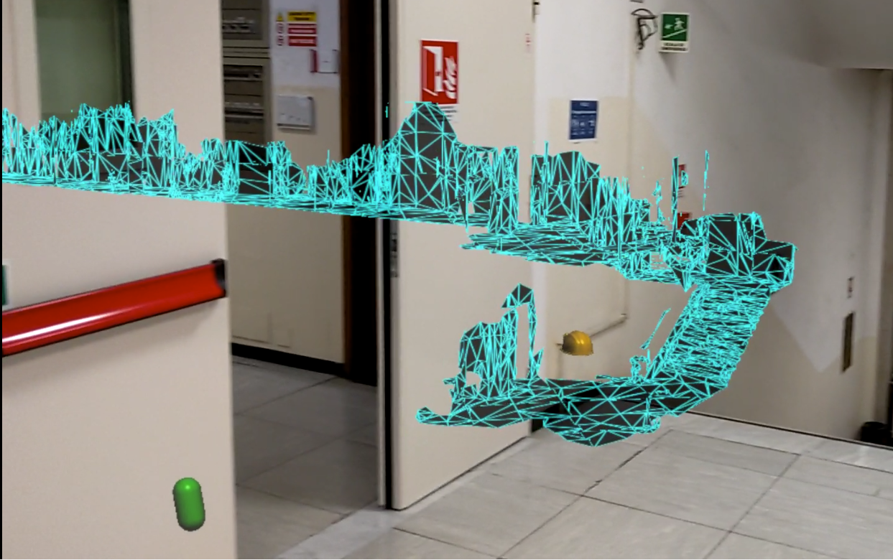
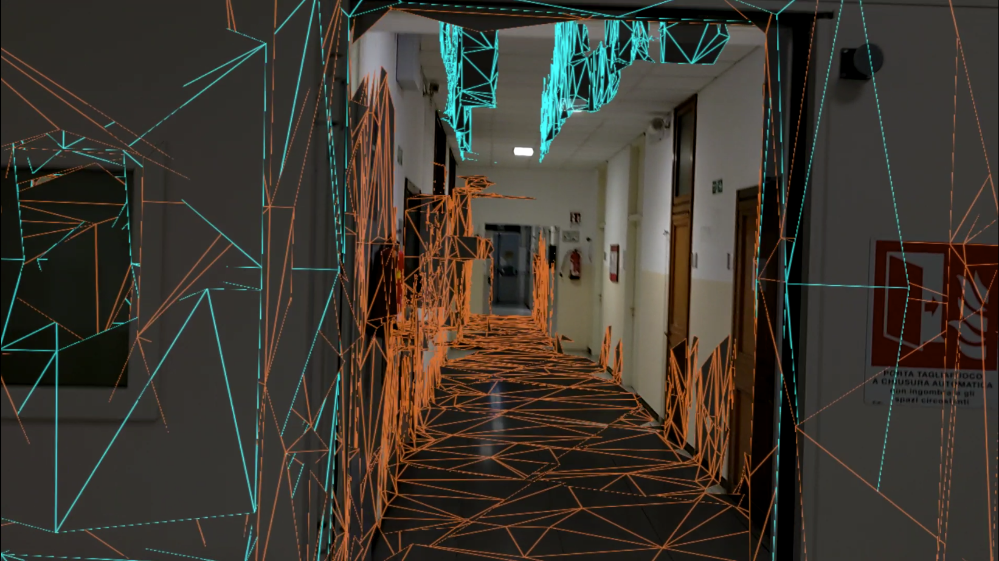
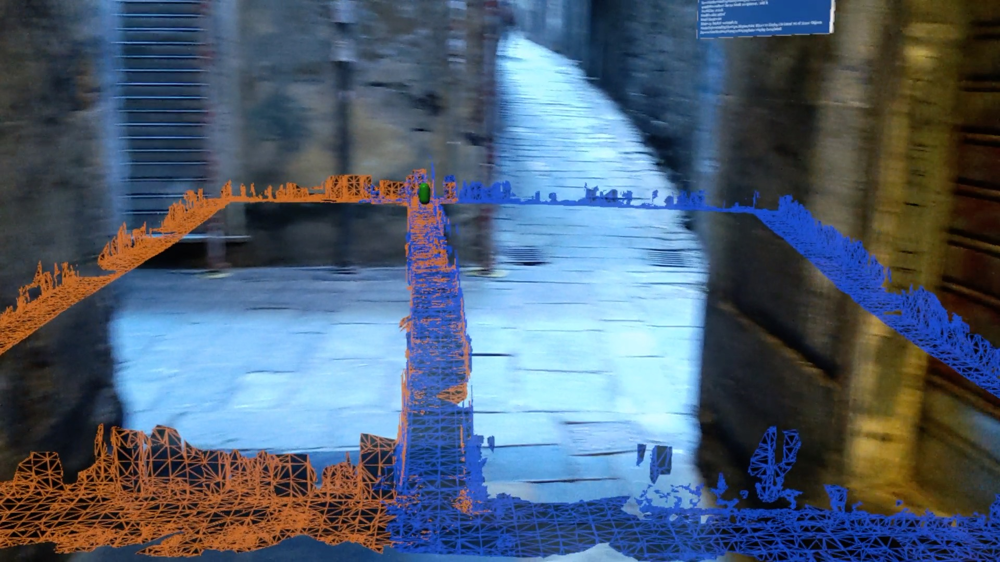
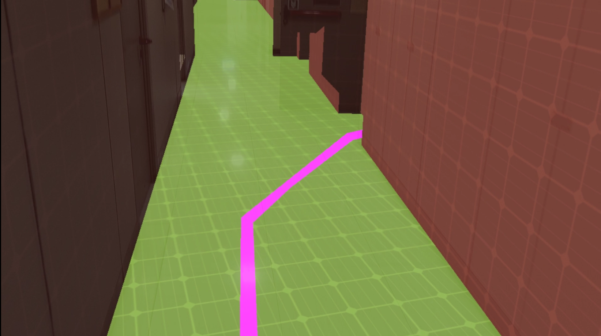

# Thesis Project

## __Project Description__
This is the repository of my Robotics Engineering thesis project, named:  
 _DIONISO-Wearable Sensors and Augmented Reality for Autonomous Mapping and Navigation in Search and Rescue_

 This project aims to provide an Augmented Reality (AR) application to improve the planning capabilities of Search and Rescue (SAR) operators during disaster scenarios like earthquakes. 
 The application enables operators to cooperate in the building process of a global virtual 3D map of the scanned environment. 
 
 In particular, SAR agents can explore the environment and simultaneously map it having both hands free. The application allows placing holograms representing meaningful information such as injured people locations or dangerous areas that must be avoided. SAR operators can visualize the map in real-time, in full scale (POV), or a resized version as well, as shown in the following pictures. 
 
  
 
  

The maps generated by multiple users will be merged so that all the users can visualize all the information generated. This concept is figured in the following picture.

  
 
 The "local maps" generated by each agent will then join a global one exploiting the Spatial Anchors and a dedicated cloud software architecture. The following pictures show how the local maps generated in different sessions are properly overlapped.

 __AREA SCANNED DURING A FIRST SESSION__

 
 
 __AREA SCANNED DURING THE SECOND SESSION__

 

  __MERGED MAPS__

 

 

 

 The system works pretty fine in both outdoor and indoor environments. In this regard, some tests have been placed in the historic center of Genoa, getting good results, as shown in the following figures.

  

  
The nice thing is that Augmented Reality is also supported by mobile devices (e.g., IoS and Android). Therefore, future implementations might enable survivors to cooperate with the rescue operations using their smartphones.
 
Finally, a navigation algorithm has been implemented to prove the system's consistency.

  

  

## __Requirements__
### __Hardware:__
- Microsoft HoloLens2
### __Software:__
| Software | Version | 
| --------| ---------|
| Unity   | 2019.4.11f1 |
| Visual Studio | v16.9.3 |
| MRTK SDK | 2.5.4 |
| Azure Spatial Anchor SDK | 2.7.1 |
| Scene Understanding SDK | 0.6.0 |
|WinRT Projections | 0.5.1052 |

## __Installation__
1. Clone the repository
2. Install the Unity and Visual Studio versions described above
3. Open Visual Studio Installer and install the Universal Windows Platform extension (IntelliCode, USB device connection, C++ UWP tools, Windows 10 SDK (10.0.17134.0))
3. Open the project in the Unity
4. Open the Scene: Assets -> Scenes -> Simple Scene
5. Open Build Settings and switch in the Universal Windows Platform
6. Select the minimum pltform version available, Visual Studio 2019 as VS version, and USB Device as Build And Run On label.  
7. Click on Player Settings -> Plyer -> XR Settings and select Virtual Reality Supported and make sure that the Depth Format is set as 16-bit depth and the Depth Buffer Sharing is enabled
8. Come back in the Build Settings window and build the application

## __Contacts__
Francesco Testa 
email: francesco.testa.ge@gmail.com
