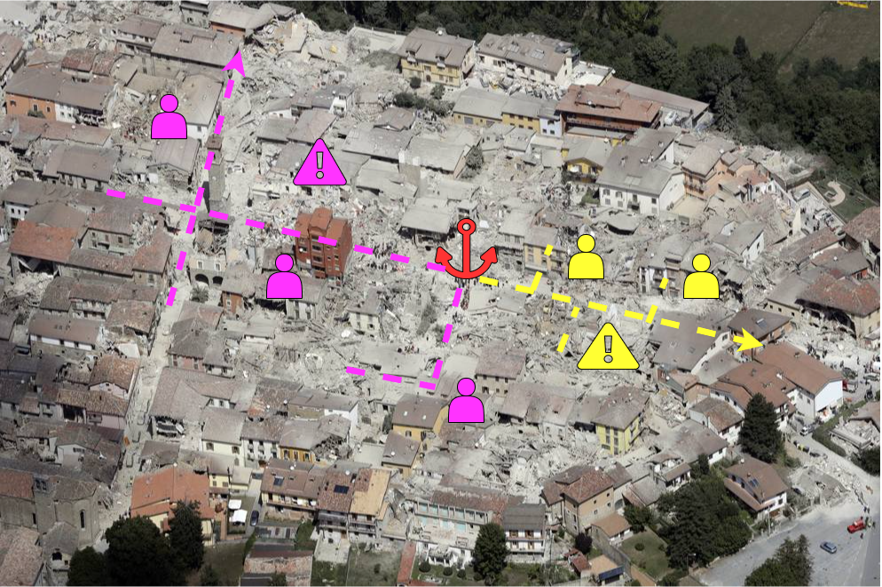
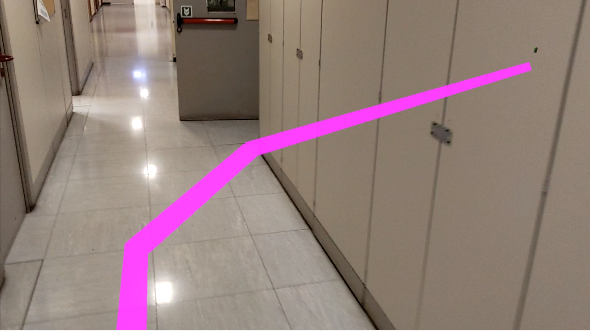

# Thesis Project

## __Project Description__
This is the repository of my Robotics Engineering thesis project, named:  
 _DIONISO-Wearable Sensors and Augmented Reality for Autonomous Mapping and Navigation in Search and Rescue_

 This project aims to provide an Augmented Reality (AR) application to improve the planning capabilities of Search and Rescue (SAR) operators during disaster scenarios like earthquakes. 
 The application enables operators to cooperate in the building process of a global virtual 3D map of the scanned environment. 
 
 In particular, SAR agents can explore the environment and simultaneously map it having both hands free. The application allows placing holograms representing meaningful information such as injured people locations or dangerous areas that must be avoided. SAR operators can visualize the map in real-time, in full scale (POV), or a resized version as well, as shown in the following pictures. 
 
  
 
  

The maps generated by multiple users will be merged so that all the users can visualize all the information generated. This concept is figured in the following picture.

  
 
 The "local maps" generated by each agent will then join a global one exploiting the Spatial Anchors and a dedicated cloud software architecture. The following pictures show how the local maps generated in different sessions are properly overlapped.

 __AREA SCANNED DURING A FIRST SESSION__

 
 
 __AREA SCANNED DURING THE SECOND SESSION__

 

  __MERGED MAPS__

 

 

 

 The system works pretty fine in both outdoor and indoor environments. In this regard, some tests have been placed in the historic center of Genoa, getting good results, as shown in the following figures.

  

  
The nice thing is that Augmented Reality is also supported by mobile devices (e.g., IoS and Android). Therefore, future implementations might enable survivors to cooperate with the rescue operations using their smartphones.
 
Finally, a navigation algorithm has been implemented to prove the system's consistency.

  

  

## __Requirements__
### __Hardware:__
- Microsoft HoloLens2
### __Software:__
| Software | Version | 
| --------| ---------|
| Unity   | 2019.4.11f1 |
| Visual Studio | v16.9.3 |
| MRTK SDK | 2.5.4 |
| Azure Spatial Anchor SDK | 2.7.1 |
| Scene Understanding SDK | 0.6.0 |
|WinRT Projections | 0.5.1052 |

## __Installation__
1. Clone the repository
2. Install the Unity and Visual Studio versions described above
3. Open Visual Studio Installer and install the Universal Windows Platform extension (IntelliCode, USB device connection, C++ UWP tools, Windows 10 SDK (10.0.17134.0))
3. Open the project in the Unity
4. Open the Scene: Assets -> Scenes -> Simple Scene
5. Open Build Settings and switch in the Universal Windows Platform
6. Select the minimum pltform version available, Visual Studio 2019 as VS version, and USB Device as Build And Run On label.  
7. Click on Player Settings -> Plyer -> XR Settings and select Virtual Reality Supported and make sure that the Depth Format is set as 16-bit depth and the Depth Buffer Sharing is enabled

The application exploits the Azure Spatial Anchors and Azure Storage Account services to guarantee a fast and reliable collaboration experience among different users. Therefore, you have to fill the fields of the following Unity module contained in the CludDataManager GameObject with your credential. 

- CloudDataManager -> Spatial Anchor Manager: please digit your Spatial Anchor Account ID, Key and Domain.
- CloudDataManager -> Data Manager: digit the connection string of your Azure Storage Account. 

## __Build & Deploy__
After the previous steps
1. Build the app: File -> Build Settings 
2. Make sure that: 
   1. Target Device = Any Device
   2. Architecture = x64
   3. Minimum Platform Version = 10.0.18362.0 (or the oldest available)
   4. Visual Studio Version = Visual Studio 2019
3. Select Build
4. Open the file.sln generated
5. Follows this to tutorial to deploy tha app according to your preferencies (e.g. USB cable or wifi): https://docs.microsoft.com/en-us/windows/mixed-reality/develop/advanced-concepts/using-visual-studio?tabs=hl2

# __Application Usage__
Currently, the user can interact with the application using voice commands. However, in the Unity Scene, you can find a Game Object to manage a hand menu that shows up some buttons when the user turns up his/her hand. When you launch the app from device you will see a green capsule which represent the shared coordinate system (Spatial Anchor) that the application use uses to share all the information among different devices or application sessions. You are free to place it wherever you want just by grasping it and moving it in the desired location. 

Follows the keywords to activate the implemented commands:
### Main Commands
- __Toggle Mesh__ = shows the scanned are as a blue triangle mesh.
- __Toggle Mini__ = generates a down-scale version of the current scanned area that you can grasp to move it and resize it.  
- __Update Mesh__ =  the holographic mesh is automatically updated, but you can refresh it by saying this command.
- __Toggle Quads__ = shows a different holographic mesh rendering of the scanned area, which infers environmental features like walls or ceilings. This mode must be enabled to use the navigation capabilities of the application.
- __Alert__ = places a holographic red cone. It is just an example of information placement that might represent a dangerous area that other operators must avoid. Any other kind of 3D object can be placed as well.
- __Navigation__ = generates a pink path to reach the current green capsule location (Spatial Anchor). Please notice that currently, to exploit this functionality, the Quads mode (Toggle Quads to enable it) must be activated, and the anchor should be placed in a location close to the ground and not too far from it.

### Shareing Commands
To easly test the collaboration skills of the application consider to: open the app -> generate and share data -> close the app -> open the app again -> download and visualize the information generated in the previous session. 
 
#### First Session:
1. Share the current anchor location saying: __Share Anchor__
2. Upload the current map and all the generated information (Holograms) saying: __Upload Map__

#### Secon Session:
1. Say: __Get ID__
2. Place the anchor saying: __Find Anchor__
3. When you visualize the anchor in the right position, Download and place the information: __Download Map__
4. You can caombine the download map and the current one saying: __Combine Maps__  

## __Contacts__
[Francesco Testa](https://www.linkedin.com/in/francesco-testa-49183b222/)

  francesco.testa.ge@gmail.com

